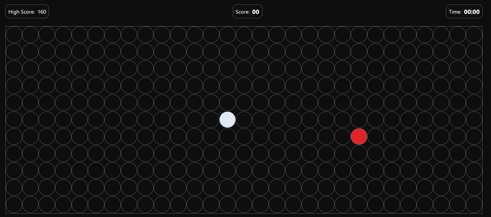

# 🐍 Snake Game

A classic Snake Game built from scratch using **HTML, CSS, and JavaScript**.

This project was built to practice JavaScript logic, DOM manipulation, arrays, loops, keyboard events, timers, and `localStorage` — without relying on a game framework or library.

## 🎮 Features

- 🐍 Snake movement using keyboard controls
- 🍎 Random food generation
- 📈 Score system
- 🏆 High score saved using `localStorage`
- ⏱️ Game timer
- 💀 Game over detection
- 🔄 Restart functionality
- 🧱 Dynamic game board generation
- 🎨 Custom UI and styling
- ⌨️ Arrow-key controls

## 🛠️ Built With

- **HTML5** — Structure
- **CSS3** — Styling and layout
- **JavaScript** — Game logic and functionality
- **LocalStorage** — High score persistence

## 🧠 What I Practiced

This project helped me practice:

- DOM Selection
- DOM Manipulation
- Arrays
- Objects
- `for` loops
- `forEach()`
- Functions
- Conditional Statements
- `setInterval()`
- Keyboard Events
- `Math.random()`
- `localStorage`
- Dynamic element creation
- Game state management

## 🎯 How It Works

The game board is generated dynamically using JavaScript.

Each position on the board is stored using its row and column coordinates. The snake's position is represented using an array of objects:

```javascript
let snake = [{x: 3, y: 13}]
```

The snake moves by calculating a new head position based on the current direction.

When the snake eats the food:

1. A new food position is generated.
2. The snake grows.
3. The score increases.
4. The high score is updated if necessary.

If the snake moves outside the board, the game ends.

## 🎮 Controls

| Key | Action |
|---|---|
| `↑` | Move Up |
| `↓` | Move Down |
| `←` | Move Left |
| `→` | Move Right |

## 📂 Project Structure

```text
Snake-Game/
│
├── index.html
├── style.css
├── variables.css
├── script.js
└── README.md
```

## 🚀 Running the Project

Clone the repository:

```bash
git clone https://github.com/shaheeer-hashmi/Snake-Game
```

Open the project folder and launch:

```text
index.html
```

Or use **Live Server** in VS Code.

## 📸 Preview

_  ._


## 👨‍💻 Author

**Shaheer Hashmi**

Built as a JavaScript practice project while improving my programming logic and DOM manipulation skills.

---

⭐ If you found this project interesting, feel free to check out the repository and explore the code.
